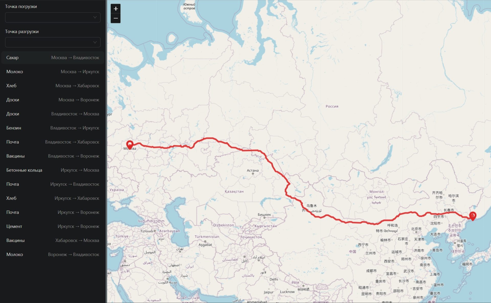

# Intelogis Logistics



A logistics and route planning application built with:
- React
- Redux Toolkit
- Redux Saga
- TypeScript
- Leaflet
- Ant Design
- create-react-app

Features:
- Interactive map display with Leaflet
- Route optimization using leaflet-routing-machine
- Redux state management with Redux Saga for side effects
- City and offer data management


## Getting Started

### Prerequisites
- Node.js v16+ (LTS versions recommended)
- npm or yarn

### Installation & Running

```bash
npm i
npm start
```

The app opens at `http://localhost:3000` with hot reload on code changes.

### Building for production

```bash
npm run build
```

The production build outputs to `build/` and is ready to deploy.